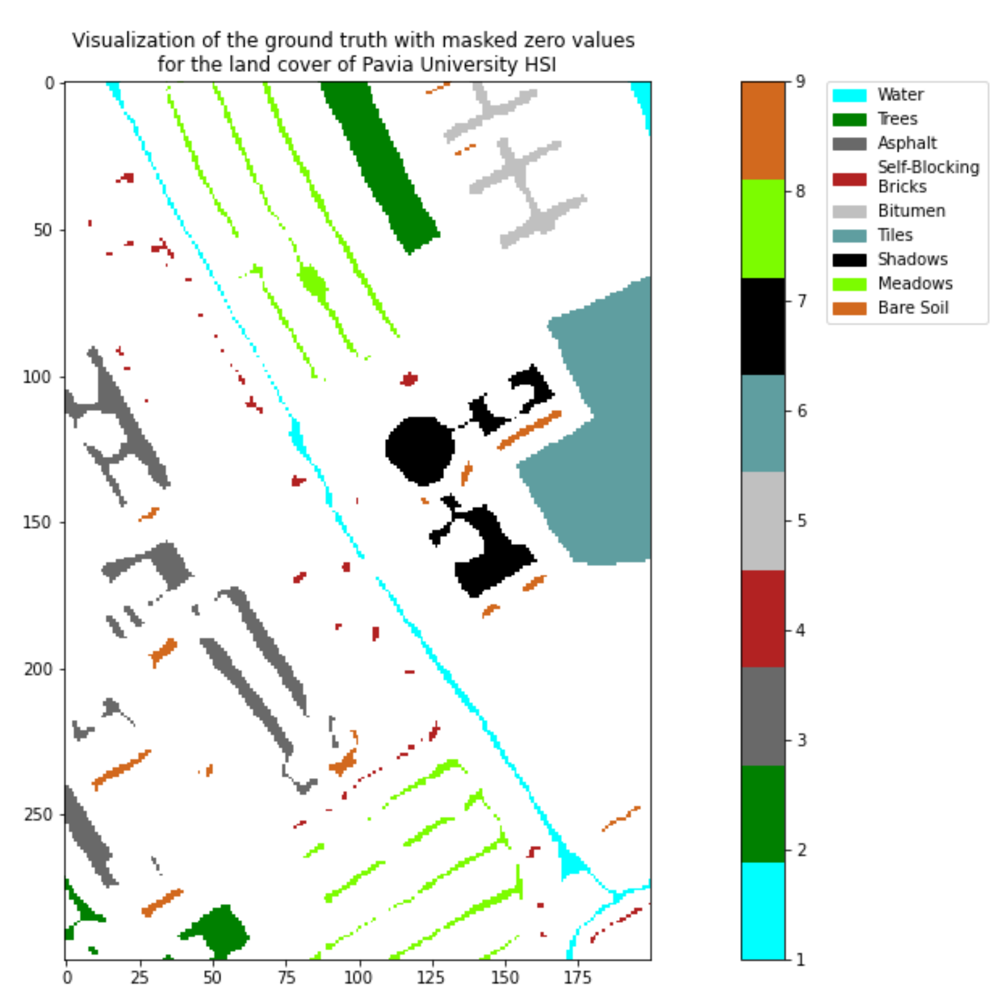

# Spectral unmixing and classification (supervised, unsupervised) with Machine Learning for Hyperspectral images (HSIs)

## Framework
An HSI depicts a specific scene at several (L) narrow continuous spectral bands (actually, they visualize the reflectance of the depicted scene in various spectral bands). It can be represented by a MxNxL three-dimensional cube, where the first two dimensions correspond to the spatial information, while the third corresponds to the spectral information. Thus, the (i,j) pixel in such an image, i=1,...,M, j=1,...,N, is represented by an L-dimensional vector (constituted by the corresponding spectral bands), called the spectral signature of the pixel.

In several remote sensing applications, the HSIs (taken from satellites) that depict specific scenes of the earth surface at a specific spatial resolution. That is, each pixel is likely to depict more than one materials depicted in the corresponding area of the scene. Such pixels are called mixed pixels and they are the vast majority of the pixels in the image. On the other hand, there are (usually) a few pixels that depict a single material. These are called pure pixels.

## Scope
In this project I apply the two main processing procedures in HSIs. These follow two main directions, namely, the spectral unmixing and the classification (supervised, unsupervised).

I use the "Pavia University" HSI dataset, which depicts an area of the University of Pavia in Italy. It is a **300x200** spatial resolution HSI and consists of **103** spectral bands, gathered by the [Reflective Optics System Imaging Spectrometer (ROSIS)](https://www.uv.es/leo/daisex/Sensors/ROSIS.htm) sensor. Its spatial resolution is 1.3m (that is, the HSI is a 300x200x103 cube). The HSI depicts materials from nine (9) classes. The data consist of:
* The Pavia University hypercube (`PaviaU_cube.mat`) and
* The class label for each pixel (`PaviaU_ground_truth.mat`).

The file `PaviaU` HSI includes 9 endmembers, each one corresponding to a certain material, as described in the following table:

|Endmember| Material|
|--|--|
|1| Water|
|2| Trees|
|3| Asphalt|
|4| Self-Blocking Bricks|
|5| Bitumen|
|6| Tiles|
|7| Shadows|
|8| Meadows|
|9| Bare Soil|

## Libraries

These are some of the libraries implemented:

* matplotlib
* numpy
* scipy
* pandas
* scipy
* sklearn (sklearn.metrics, sklearn.neighbors, sklearn.naive_bayes, sklearn.model_selection, sklearn.linear_model)

## Code

The plots, models and results are presented in a [Jupyter Notebook](spectral_unmixing_classification_ML_Androvitsanea.ipynb).

## Part 1: Spectral unmixing (SU)

In this part I consider the set consisting of the 9 endmembers, where each endmember has a specific spectral signature, which corresponds to the pure pixels in the HSI dataset. 

For a given pixel in the image, the aim is to determine the percentage (abundance) that each pure material contributes in its formation and **unmix** the pixels.

I fit linear regression models that connect the 9 endmembers with the mixed pixels of the HSI dataset.

I consider the following models:

### (a) Least squares

### (b) Least squares imposing the sum-to-one constraint for $\theta$s,

### (c) Least squares imposing the sum-to-one constraint for $\theta$s,

### (d) Least squares imposing both the non-negativity and the sum-to-one constraint for $\theta$s,

### (e) LASSO, imposing sparsity on $\theta$s via $l_1$ norm minimization.

First, I calculate the abundance maps for each material, i.e. 9 maps. 

Then I compute the reconstruction error as follows:

I calculate the reconstruction error (for each non-zero class label) of **each pixel** using the formula:
    $error = \frac{||\mathbf{y}_i - \mathbf{X}\mathbb{\theta}_i||^2}{||\mathbf{y}_i||^2}$
Then, for **N pixels** I compute the **average** value:
<!--    $\text{reconstruction error} = \frac{error}{N} $-->
    

        
Finaly, I [compare](#Comparison-of-regressors) the results obtained from the above five methods based on the abundance maps and the reconstruction error.

## Part 2: Classification

In this case, I consider also the image pixels with non-zero class label.I assign each one of them to the most appropriate class, among the 9 known classes.

The classification is perfomed with **four** classifiers:

* (i) the naïve Bayes classifier, 
* (ii) the minimum Euclidean distance classifier, 
* (iii) the k-nearest neighbor classifier and 
* (iv) the Bayesian classifier

### (A) Classification for each classifier
The **first step** is the performance of a 10-fold cross validation for each classifier. For this step the estimated validation error gets reported.

### (B) Comparison of classifiers
The **second step** is the training of each classifier and the evaluation of its performance. This includes the computation of the following metrics:

* estimated validation error
* confusion matrix and 
* success rate of the classifier.

Finally I compare the results of the four classifiers.

